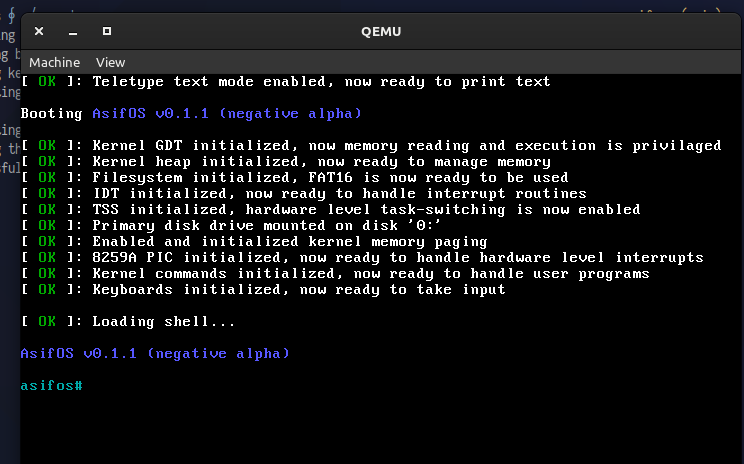
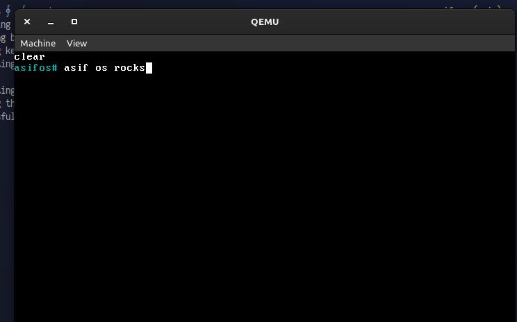

<h1 align="center">AsifOS (educational)</h1>

AsifOS (educational) is a fully-functioning Operating System from scratch for learning purposes.

## Why this project
The wonders of Operating Systems, especially how they are implemented, always fascinated me. I always thought about how the software actually communicates with the hardware, what happens when we press a key in the keyboard and how a process can read it. With this project I am blessed with the knowledge and wonders of Low-Level comoputing.

## Features of AsifOS (educational)
1. Bootloader implemented in Intel Real Mode (i8086 16-bit), which will be a raw bootable machine code.
2. Small part of bootloader loading the kernel and the entire kernel implementation in Intel Protected Mode (i80386 32-bit).
3. The kernel is written in C entirely, the best programming language ever created.
4. Memory Management using Paging and Heap.
5. Virtual File Systems.
6. FAT16 file system implementation.
7. Hardware level interrupts using Intel's 8259A PIC.
8. Implementation of Disk Drivers.
9. PS/2 Keyboard driver.
10. Implementation of Processes and Threads/Tasks.
11. Preemptive multi-tasking using Round-Robin schedular algorithm.
12. Implementation of loading processes from raw binary and 32-bit ELF file format, used by famous OS's like Linux.
13. Kernel and user space protections.
14. Kernel Commands with interrupt driven System Calls.
15. A user space shell program to interact with the Operating System.
16. Other miscellaneous implementations like TTY and other microarchitecture related stuff.

**Note:** AsifOS only supports i386 architecture and BIOS boot for now.
## How to build
### Prerequisite installations: 
**Linux:** Install the `i386-elf-toolchain` and `nasm` according to the distro you are using (Good luck with Ubuntu). We need `qemu` for testing as well.

**MacOS:** Try [nativeos/homebrew-i386-elf-toolchain](https://github.com/nativeos/homebrew-i386-elf-toolchain), install `nasm` and `qemu` with regular homebrew formulae. Haven't tested in Macintosh.

**Windows:** May God have mercy on your soul.
### Build and run:
Just invoke `run.sh`. It will then invoke `make` to build the entire project generating `os.img` and then run it with `qemu-system-i386`.

## Demonstrations

<b>This project is not production ready, I did this project for educational purposes only. Check out [AsifOS (production)](https://github.com/AsifOS), which I am currently working on.</b>

<b><i>Peace.</i></b>
